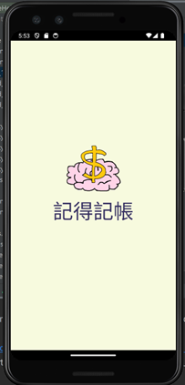
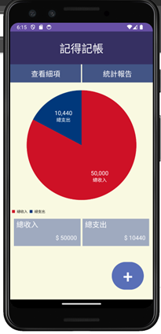
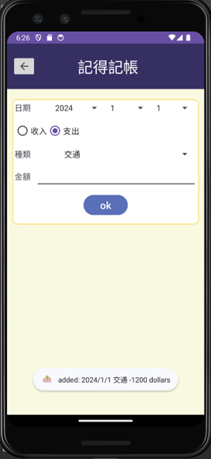
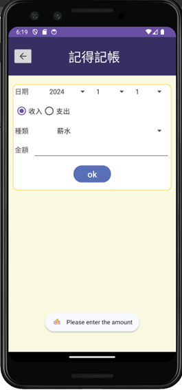
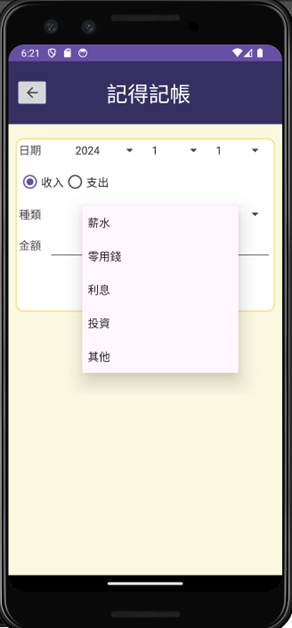
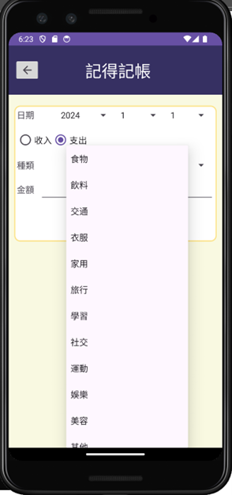
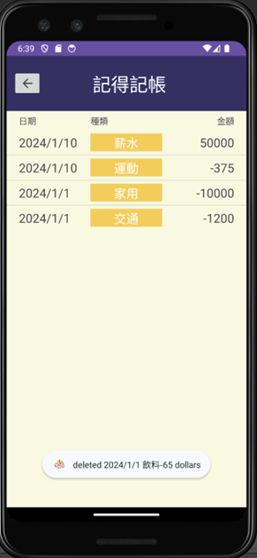
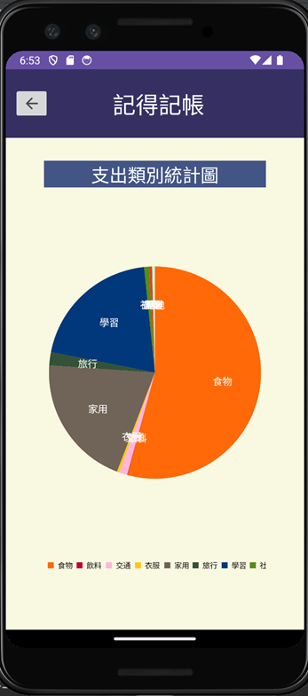
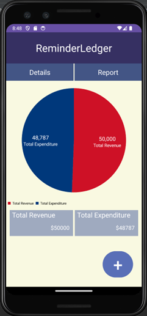
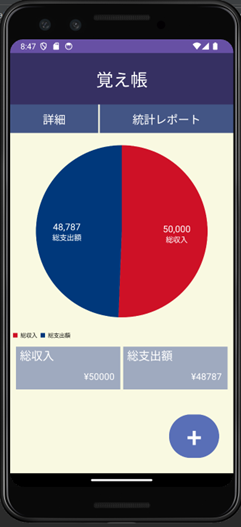

# 記得記帳 ReminderLedger (覚え帳)

這是一個基於 Android 平台開發的個人財務管理應用程式，旨在幫助使用者精確記錄收支，並透過視覺化統計圖表檢討消費習慣。

## 目的與特色
*   **精確紀錄**：確實記錄每一筆支出與收入金額
*   **視覺化分析**：
    *   **主畫面圓餅圖**：即時顯示總收支比例，掌握損益狀況
    *   **分類統計報告**：針對支出類別進行分析，方便檢討消費習慣
*   **詳細歷史紀錄**：記錄每筆帳務的日期、種類與金額，支援長按刪除功能
*   **多國語言支援**：支援繁體中文、英文與日文切換
*   **使用者友善介面**：包含啟動畫面與輸入防呆提醒

## 使用元件與技術
本專案應用了多項 Android 開發核心技術：
*   **UI 佈局**：`LinearLayout`, `RelativeLayout`, `ListView`, `RadioGroup`, `Spinner`
*   **資料存取**：`SQLiteDatabase`, `DatabaseHelper` (自定義資料庫管理), `SimpleCursorAdapter`
*   **圖表插件**：`PieChart` (視覺化統計圖)
*   **核心功能**：`Intent` (頁面跳轉), `Handler` (自動跳轉邏輯), `Toast` (防呆提醒)
*   **多語言實作**：透過 `values/strings.xml` 達成多國語系適配

## 操作說明與畫面展示

### 1. 應用程式圖示 (App Icon)
| 圓形圖示 | 小畫家手繪原圖 |
| :---: | :---: |
|  |  |

### 2. 核心功能展示

| 功能項目 | 畫面說明 | 介面預覽 |
| :--- | :--- | :---: |
| **啟動與主畫面** | 包含 Logo 啟動畫面及收支圓餅圖統計 |   |
| **新增紀錄** | 點擊右下角 `+` 加入紀錄，具備金額防呆提醒 |   |
| **動態類別** | 根據選擇「收入」或「支出」自動切換 Spinner 選項 |  |
| **查看細項** | 列出所有歷史紀錄，支援**長按刪除** |  |
| **統計報告** | 詳細的支出類別比例圓餅圖 |  |
| **多國語言** | 支援英文與日文介面切換 |  |

## 📂 專案結構
```text
java/com.example.money_3/
├── MainActivity.java     # 主畫面統計邏輯
├── addNew.java           # 新增帳務邏輯
├── checkDetails.java     # 詳細紀錄與刪除功能
├── myReport.java         # 分類統計圖表
├── splash.java           # 啟動畫面延遲跳轉
├── DatabaseHelper.java   # 資料庫定義
└── DatabaseManager.java  # 資料庫 CRUD 操作
```